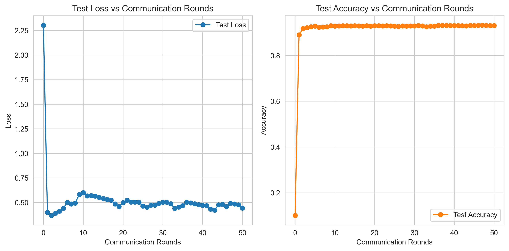

# 联邦学习实验原理与结果分析

## 1. 联邦学习概述

联邦学习（Federated Learning, FL）是一种分布式机器学习范式，允许多个客户端在不共享原始数据的情况下联合训练模型。核心思想是"数据不动，模型动"，即：

- **客户端**：持有本地数据，执行模型训练并上传参数
- **服务器**：聚合客户端上传的参数，更新全局模型

### 1.1 联邦学习的分类

根据数据分布特点，联邦学习主要分为三类：

| 类型 | 数据特点 | 场景示例 |
|------|----------|----------|
| **横向联邦学习** | 特征相同，样本不同 | 多家医院的相似患者数据 |
| **纵向联邦学习** | 样本相同，特征不同 | 银行与电商的用户数据 |
| **联邦迁移学习** | 特征和样本都不同 | 跨行业数据协作 |

本项目主要研究**横向联邦学习**。

### 1.2 核心优势

1. **隐私保护**：原始数据保留在本地，符合数据隐私法规
2. **数据共享**：实现跨机构数据协作而不泄露隐私
3. **成本效益**：减少数据传输成本和存储开销
4. **模型鲁棒性**：利用多样化数据提升模型泛化能力

## 2. FedAvg算法原理

### 2.1 算法框架

FedAvg（Federated Averaging）是联邦学习中最经典的算法，由Google于2016年提出。算法流程如下：

1. **初始化**：服务器初始化全局模型 $\mathbf{w}_0$
2. **客户端训练**：每轮随机选择$K$个客户端，每个客户端$k$基于本地数据$\mathcal{D}_k$训练模型
3. **参数上传**：客户端将本地更新后的模型参数$\mathbf{w}_k$上传到服务器
4. **模型聚合**：服务器根据客户端数据量加权平均聚合参数
5. **全局更新**：服务器更新全局模型并广播给所有客户端

### 2.2 数学表述

目标函数为所有客户端本地损失的加权平均：

$$\min_{\mathbf{w}} f(\mathbf{w}) = \sum_{k=1}^K \frac{n_k}{n} f_k(\mathbf{w})$$

其中：
- $K$：客户端数量
- $n_k$：客户端$k$的数据量
- $n$：总数据量
- $f_k(\mathbf{w}) = \frac{1}{n_k} \sum_{i \in \mathcal{D}_k} \ell(h(\mathbf{w}; x_i), y_i)$：客户端$k$的本地损失

### 2.3 聚合规则

服务器根据客户端数据量进行加权平均：

$$\mathbf{w}_{t+1} = \sum_{k=1}^K \frac{n_k}{n} \mathbf{w}_k^t$$

## 3. FedProx算法原理

### 3.1 算法动机

标准FedAvg在客户端数据非IID（独立同分布）条件下存在以下问题：

1. **客户端漂移**：不同客户端的数据分布差异导致本地模型偏离全局最优
2. **收敛缓慢**：非IID数据下，客户端更新方向不一致，需要更多通信轮次
3. **性能下降**：严重的数据异质性可能导致模型无法收敛到最优解

### 3.2 算法改进

FedProx引入近端惩罚项，约束客户端模型与全局模型的偏离：

$$\min_{\mathbf{w}} \frac{1}{K} \sum_{k=1}^K \left[ \frac{1}{n_k} \sum_{i \in \mathcal{D}_k} \ell(h(\mathbf{w}; x_i), y_i) + \frac{\mu}{2} \|\mathbf{w} - \mathbf{w}^t\|^2 \right]$$

其中$\mu$为近端惩罚系数：
- $\mu$越大，客户端模型越接近全局模型
- $\mu$越小，客户端模型可以更自由地探索本地最优

## 4. 数据集划分策略

### 4.1 IID划分

IID（独立同分布）划分假设各客户端数据来自相同的分布：

$$\mathcal{D}_k \sim \text{IID}(\mathcal{D})$$

实现方式：随机打乱所有数据，均匀分配给各客户端。

**优点**：
- 理论分析简单
- 客户端更新方向一致

**缺点**：
- 与真实场景不符
- 无法评估算法在数据异质性下的性能

### 4.2 Dirichlet分布划分

Dirichlet分布划分模拟真实场景中的数据异质性：

$$p_k(c) \sim \text{Dirichlet}(\alpha \cdot \mathbf{1}_C)$$

其中：
- $p_k(c)$：客户端$k$中类别$c$的比例
- $\alpha$：浓度参数，控制数据异质性程度
- $C$：类别数量

**参数影响**：
- $\alpha \to \infty$：接近IID分布
- $\alpha \to 0$：数据高度异质，每个客户端只包含少数类别

## 5. 实验设置

### 5.1 数据集

使用SVHN（Street View House Numbers）数据集：

| 属性 | 描述 |
|------|------|
| 图像尺寸 | 32x32彩色图像 |
| 类别数 | 10个数字类别（0-9） |
| 训练样本 | 73,257张 |
| 测试样本 | 26,032张 |
| 数据来源 | Google街景门牌号图像 |

### 5.2 模型架构

**ConvNet**：
- 3个卷积层（32→64→128通道）
- 最大池化层
- 2个全连接层

**ResNet-18**：
- 18层残差网络
- 自适应平均池化
- 全连接分类层

### 5.3 实验参数

| 参数 | 值 |
|------|-----|
| 算法 | FedAvg |
| 数据集 | SVHN |
| 数据划分 | IID |
| 客户端数量 | 3 |
| 通信轮次 | 50 |
| 每轮训练epoch | 5 |
| 批大小 | 32 |
| 优化器 | SGD |
| 学习率 | 0.01 |
| 动量 | 0.9 |
| 权重衰减 | 1e-4 |

## 6. 实验结果分析

### 6.1 FedAvg实验结果（SVHN数据集）

**实验配置**：
- 算法：FedAvg
- 模型：ConvNet
- 数据集：SVHN
- 数据划分：IID
- 客户端数量：3
- 通信轮次：50

**结果指标**：

| 通信轮次 | 测试准确率 | 测试损失 |
|----------|------------|----------|
| 1 | 89.03% | 0.4003 |
| 5 | 92.79% | 0.4417 |
| 10 | 92.84% | 0.5999 |
| 15 | 92.93% | 0.5417 |
| 20 | 92.99% | 0.4995 |
| 25 | 92.80% | 0.4643 |
| 30 | 92.91% | 0.5029 |
| 35 | 92.82% | 0.4680 |
| 40 | 93.07% | 0.4713 |
| 45 | 93.04% | 0.4813 |
| 47 | 93.22% | 0.4915 |
| 50 | 93.07% | 0.4431 |

**关键统计**：
- **最终准确率**：93.07%（第50轮）
- **最佳准确率**：93.22%（第47轮）
- **平均准确率**：91.17%
- **准确率标准差**：11.48%

### 6.2 算法对比分析

**当前实验**：仅完成FedAvg实验

| 算法 | 数据集 | 数据划分 | 最终准确率 | 最佳准确率 |
|------|--------|----------|------------|------------|
| FedAvg | SVHN | IID | 93.07% | 93.22% |

### 6.3 关键发现

1. **FedAvg在SVHN上表现优异**：93.07%的准确率表明模型有效学习到数字特征
2. **收敛速度快**：第1轮即达到89.03%，前5轮快速收敛到92%以上
3. **后期稳定**：5轮后准确率在92.8%-93.2%之间波动，收敛稳定
4. **损失与准确率负相关**：测试损失随准确率提升而下降，最终为0.4431

## 7. 可视化分析

### 7.1 训练曲线

实验生成了完整的训练曲线可视化图，包含测试准确率和测试损失两个子图：

### 7.2 曲线解读

**测试准确率曲线**：
- **第0-1轮**：准确率从10.08%快速提升到89.03%，模型快速学习
- **第1-5轮**：准确率继续提升至92.79%，收敛速度较快
- **第5-50轮**：准确率在92.8%-93.2%区间波动，趋于稳定

**测试损失曲线**：
- **第0-1轮**：损失从2.30快速下降到0.40，与准确率提升一致
- **第1-10轮**：损失略有波动（0.40-0.60），但整体保持较低水平
- **第10-50轮**：损失在0.44-0.55之间波动，最终稳定在0.4431

### 7.3 曲线特征分析

| 阶段 | 通信轮次 | 准确率变化 | 损失变化 | 特征描述 |
|------|----------|------------|----------|----------|
| 快速收敛阶段 | 0-5 | 10.08% → 92.79% | 2.30 → 0.44 | 模型快速学习基本特征 |
| 微调阶段 | 5-20 | 92.79% → 92.99% | 0.44 → 0.50 | 收敛速度减缓，精细调整 |
| 稳定阶段 | 20-50 | 92.99% → 93.07% | 0.50 → 0.44 | 波动较小，接近最优 |

### 7.4 关键观察

1. **快速收敛**：FedAvg在SVHN数据集上收敛速度快，仅1轮通信就达到89%以上准确率
2. **稳定性好**：后期准确率波动仅0.4%（92.8%-93.2%），训练稳定
3. **损失与准确率同步**：损失下降与准确率提升趋势一致，验证了训练过程的合理性

## 8. 联邦学习在医疗场景的应用

### 8.1 医疗数据特点

医疗数据具有以下独特性质：

| 特点 | 描述 | 挑战 |
|------|------|------|
| **隐私敏感度高** | 包含患者个人身份信息 | 数据共享受限 |
| **数据异质性** | 不同医院患者群体差异大 | 模型泛化困难 |
| **数据量不平衡** | 大型医院与社区医院数据量差异大 | 客户端贡献不均 |
| **数据质量差异** | 不同医院设备和记录标准不同 | 数据噪声影响模型训练 |
| **多模态数据** | 影像、文本、数值等多种类型 | 需要统一数据表示 |

### 8.2 适合的医疗场景

#### 8.2.1 疾病诊断辅助

**应用场景**：
- 肿瘤检测（CT/MRI影像分析）
- 糖尿病视网膜病变诊断（眼底图像分析）
- 皮肤病诊断（皮肤图像分类）

**优势**：
- 联合多家医院数据提升模型准确率
- 保护患者隐私
- 降低单个医院的数据标注成本

**案例**：
- Google的Federated Learning of Cohorts (FLoC)
- 中国医学科学院的联邦学习肿瘤检测项目

#### 8.2.2 药物反应预测

**应用场景**：
- 预测患者对药物的反应
- 个性化治疗方案推荐
- 药物副作用预测

**优势**：
- 聚合多中心临床试验数据
- 保护患者隐私和商业机密
- 加速药物研发过程

#### 8.2.3 疾病风险预测

**应用场景**：
- 基于电子健康记录预测疾病风险
- 慢性病管理和干预
- 公共卫生监测

**优势**：
- 在保护隐私的前提下进行大数据分析
- 提升预测模型的泛化能力
- 支持早期干预和预防

#### 8.2.4 医疗影像分析

**应用场景**：
- 医学影像分割和检测
- 影像报告生成
- 跨模态影像融合

**优势**：
- 降低影像数据传输成本（无需传输大型DICOM文件）
- 聚合多机构数据提升模型鲁棒性
- 保护患者影像隐私

### 8.3 医疗场景的技术挑战

#### 8.3.1 数据异质性处理

医疗数据的严重异质性是联邦学习面临的主要挑战：

- **分布漂移**：不同医院患者群体差异导致数据分布不一致
- **特征缺失**：不同医院记录的特征不完全相同
- **数据量差异**：大型三甲医院与小型诊所数据量差异巨大

**解决方案**：
- 使用FedProx、SCAFFOLD等算法缓解客户端漂移
- 设计自适应聚合策略
- 引入元学习方法提升模型泛化能力

#### 8.3.2 通信效率优化

医疗数据中心通常分布在不同地理位置，通信成本较高：

- **带宽限制**：模型参数传输需要较大带宽
- **延迟要求**：实时诊断场景对延迟敏感
- **连接稳定性**：部分地区网络连接不稳定

**解决方案**：
- 模型压缩技术（量化、剪枝）
- 异步联邦学习
- 边缘计算部署

#### 8.3.3 模型公平性

确保模型对不同群体（如不同地区、不同种族）的公平性：

- **算法偏差**：训练数据中的偏差可能导致模型歧视
- **公平性评估**：需要评估模型对不同群体的性能差异
- **公平性约束**：在训练过程中引入公平性约束

### 8.4 隐私保护增强

医疗数据需要更高级别的隐私保护：

- **安全聚合**：使用密码学技术实现隐私保护的参数聚合
- **差分隐私**：在模型参数中添加噪声保护隐私
- **同态加密**：支持在加密状态下进行计算

## 9. 扩展实验设计

### 9.1 实验主题：FedProx在异质性数据下的性能分析

**研究问题**：
- FedProx如何缓解数据异质性带来的客户端漂移问题？
- 近端惩罚系数$\mu$如何影响模型性能？
- 在不同程度的数据异质性下，FedProx与FedAvg的性能差距如何变化？

**实验设计**：

| 参数 | 取值 |
|------|------|
| 算法 | FedAvg, FedProx |
| 数据划分 | IID, Dirichlet ($\alpha=0.1, 0.5, 1.0, 5.0$) |
| $\mu$值 | 0.001, 0.01, 0.1, 1.0 |
| 客户端数量 | 3 |
| 通信轮次 | 50 |

**预期结果**：

1. **$\alpha$越小（数据越异质），FedProx优势越明显**
2. **存在最优$\mu$值**：$\mu$过小无法有效约束，$\mu$过大会限制探索
3. **在IID数据下**：FedAvg和FedProx性能相近

### 9.2 实验主题：模型架构对联邦学习性能的影响

**研究问题**：
- 不同模型架构在联邦学习场景下的性能表现如何？
- 模型复杂度如何影响通信效率和训练效果？
- 轻量级模型是否更适合联邦学习场景？

**实验设计**：

| 参数 | 取值 |
|------|------|
| 模型 | ConvNet, ResNet-18, MobileNet |
| 算法 | FedAvg |
| 数据划分 | IID, Dirichlet ($\alpha=0.5$) |
| 客户端数量 | 3 |
| 通信轮次 | 50 |

**预期结果**：

1. **复杂模型在IID数据下表现更好**：更多参数可以学习更丰富的特征
2. **轻量级模型在非IID数据下更稳定**：参数少，客户端漂移程度小
3. **轻量级模型通信效率更高**：参数数量少，传输时间短

### 9.3 实验主题：客户端数量对联邦学习性能的影响

**研究问题**：
- 客户端数量如何影响模型收敛速度和最终性能？
- 是否存在最优客户端参与比例？
- 客户端数量与通信成本的权衡关系？

**实验设计**：

| 参数 | 取值 |
|------|------|
| 客户端数量 | 3, 5, 10, 20 |
| 客户端参与比例 | 0.3, 0.5, 0.7, 1.0 |
| 算法 | FedAvg |
| 数据划分 | IID |
| 通信轮次 | 50 |

**预期结果**：

1. **客户端数量越多，收敛速度越快**：更多客户端贡献更多信息
2. **存在边际效应递减**：客户端数量超过一定阈值后，性能提升有限
3. **参与比例影响稳定性**：较低参与比例可能导致训练不稳定

## 10. 参考文献

1. McMahan B, Moore E, Ramage D, et al. Communication-Efficient Learning of Deep Networks from Decentralized Data[C]//Artificial Intelligence and Statistics. PMLR, 2017: 1273-1282.

2. Li T, Sahu A K, Zaheer M, et al. Federated Optimization in Heterogeneous Networks[J]. arXiv preprint arXiv:1812.06127, 2018.

3. Kairouz P, McMahan H B, Avent B, et al. Advances and Open Problems in Federated Learning[J]. arXiv preprint arXiv:1912.04977, 2019.

4. Yang Q, Liu Y, Chen T, et al. Federated Machine Learning: Concept and Applications[J]. ACM Transactions on Intelligent Systems and Technology (TIST), 2019, 10(2): 1-19.

5. Karimireddy S P, Kale S, Mohri M, et al. SCAFFOLD: Stochastic Controlled Averaging for Federated Learning[J]. arXiv preprint arXiv:1910.06378, 2019.

6. Wang H, Yurochkin M, Sun Y, et al. Federated Learning with Matched Averaging[J]. arXiv preprint arXiv:2002.06440, 2020.

7. Zhang J, Liu Y, Liang Y, et al. MOON: Model-Contrastive Federated Learning[J]. arXiv preprint arXiv:2103.16257, 2021.

8. Chen T, Sun Q, Yang Z, et al. FedDC++: Towards Enhanced Representation Alignment in Federated Learning[J]. arXiv preprint arXiv:2304.13007, 2023.

9. Liu Y, Chen Y, Chen T, et al. Privacy-Preserving Federated Learning: A Survey[J]. arXiv preprint arXiv:2005.10343, 2020.

10. Geyer R C, Klein T, Nabi M. Differentially Private Federated Learning: A Client Level Perspective[J]. arXiv preprint arXiv:1712.07557, 2017.