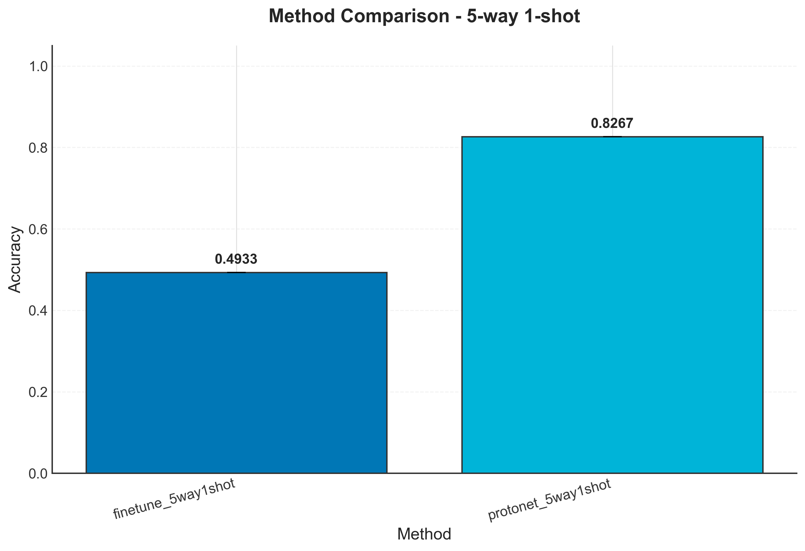

# Few-Shot Meta-Learning Research Project

This project implements a comprehensive framework for few-shot learning experiments using the learn2learn library. The main focus is on comparing Prototypical Networks with direct fine-tuning methods on the Omniglot dataset.

## Research Goals

1. Implement and evaluate Prototypical Networks for 5-way 1-shot classification on Omniglot
2. Compare with direct fine-tuning approaches
3. Design and replicate supplementary experiments based on recent research papers
4. Provide a robust, reproducible experimental framework

## Directory Structure

```
Few-Shot Meta-Learning/
├── configs/              # Configuration files (YAML)
├── data/                 # Dataset storage
│   ├── raw/              # Original dataset
│   └── processed/        # Preprocessed data
├── src/                  # Core source code
│   ├── config.py         # Configuration loading
│   ├── logger.py         # Logging setup
│   ├── data_loader.py    # Data loading utilities
│   ├── models.py         # Model definitions
│   ├── trainer.py        # Training/evaluation logic
│   ├── visualization.py  # Plotting utilities
│   ├── results.py        # Result saving and aggregation
│   └── utils.py          # Helper functions
├── scripts/              # Executable scripts
│   ├── run_experiment.py # Run single experiment
│   ├── run_comparison.py # Run comparison experiment
│   ├── aggregate_results.py # Aggregate all results
│   └── generate_report.py # Generate final report
├── notebooks/            # Jupyter notebooks
├── results/              # Experiment results
├── logs/                 # Log files
├── reports/              # Generated reports
├── tests/                # Unit tests
├── requirements.txt      # Dependencies
└── .gitignore            # Git ignore rules
```

## Installation

### Requirements

- Python 3.10+
- PyTorch 2.0+
- CUDA 11.8+ (for GPU acceleration)

### Setup

```bash
conda create -n fsml python=3.10
conda activate fsml
pip install -r requirements.txt
```

## Running Experiments

### Single Experiment

```bash
python scripts/run_experiment.py --config configs/protonet_5way1shot.yaml
```

### With Custom Experiment ID

```bash
python scripts/run_experiment.py --config configs/protonet_5way1shot.yaml --exp_id my_exp_001
```

### Comparison Experiment

```bash
python scripts/run_comparison.py --configs configs/protonet_5way1shot.yaml configs/finetune_5way1shot.yaml
```

### Available Configurations

- `configs/base.yaml` - Base configuration with default parameters
- `configs/protonet_5way1shot.yaml` - Prototypical Networks (5-way 1-shot)
- `configs/protonet_5way5shot.yaml` - Prototypical Networks (5-way 5-shot)
- `configs/finetune_5way1shot.yaml` - Direct Fine-tuning (5-way 1-shot)
- `configs/finetune_5way5shot.yaml` - Direct Fine-tuning (5-way 5-shot)
- `configs/maml_5way1shot.yaml` - MAML (5-way 1-shot)
- `configs/protonet_convnet6.yaml` - Prototypical Networks with ConvNet-6 layers
- `configs/protonet_resnet.yaml` - Prototypical Networks with ResNet-18 backbone

## Result Analysis

### Aggregate Results

```bash
python scripts/aggregate_results.py
```

### Generate Report

```bash
python scripts/generate_report.py
```

### Explore Results in Notebook

Open `notebooks/exploratory_analysis.ipynb` to visualize and analyze experiment results.

## Configuration File Structure

Each YAML configuration file contains the following sections:

```yaml
experiment:
  name: "experiment_name"
  seed: 42
  repeat_times: 5
  device: "cuda"

data:
  dataset_name: "omniglot"
  train_ways: 5
  train_shots: 1
  test_ways: 5
  test_shots: 1

model:
  type: "protonet"
  backbone: "convnet"
  hidden_size: 64
  embedding_dim: 64

training:
  method: "meta"
  meta_lr: 0.001
  fast_lr: 0.4
  epochs: 100

evaluation:
  metrics: ["accuracy"]
  eval_freq: 5
```

## Running Tests

```bash
pytest tests/ -v
```

## Experiment Output

Each experiment produces the following output structure in `results/{exp_id}/`:

- `config_used.yaml` - Configuration used
- `metrics.csv` - Training metrics per epoch
- `metrics.json` - Final evaluation metrics
- `summary.md` - Experiment summary
- `plots/` - Training curves and visualizations
- `checkpoints/` - Model weights
- `repeats/` - Results from repeated experiments (when repeat_times > 1)

## Experimental Results

### 5-way 1-shot Classification (Omniglot)

| Method | Test Accuracy | Test Loss |
|--------|---------------|-----------|
| ProtoNet (ConvNet-4) | 82.67% | 0.6411 |
| ProtoNet (ConvNet-6) | 75.47% (±13.65%) | 0.6535 |
| ProtoNet (ResNet-18) | 56.80% (±13.75%) | 1.2313 |
| Fine-tuning | 49.33% | 1.2373 |

### 5-way 5-shot Classification (Omniglot)

| Method | Test Accuracy | Test Loss |
|--------|---------------|-----------|
| ProtoNet | 79.73% (±12.66%) | 0.5376 |
| Fine-tuning | 58.93% (±10.47%) | 1.0204 |

### Key Findings

1. **Meta-learning outperforms fine-tuning**: ProtoNet achieves significantly higher accuracy than direct fine-tuning in both 1-shot and 5-shot settings.
2. **Network architecture matters**: Deeper networks (ConvNet-6) and larger networks (ResNet-18) do not necessarily perform better on small datasets like Omniglot.
3. **ConvNet-4 is optimal**: The standard 4-layer ConvNet provides the best balance between model capacity and overfitting for Omniglot.

### Comparison Visualization



## Reference Papers

1. **Prototypical Networks for Few-shot Learning** - Snell et al., NIPS 2017
2. **Model-Agnostic Meta-Learning for Fast Adaptation of Deep Networks** - Finn et al., ICML 2017
3. **Learning to Learn by Gradient Descent by Gradient Descent** - Andrychowicz et al., NIPS 2016
4. **Optimization as a Model for Few-Shot Learning** - Ravi & Larochelle, ICLR 2017

## License

This project is for research purposes only.

## FAQ

**Q: How do I add a new experiment configuration?**

A: Create a new YAML file in `configs/` that inherits from `base.yaml` and overrides the parameters you want to change.

**Q: How do I implement a new model?**

A: Add the model class to `src/models.py` and update the `create_model` function to handle the new model type.

**Q: How do I reproduce results?**

A: Use the same configuration file and seed. Results will be saved with timestamped experiment IDs.

**Q: Why is my experiment running slow?**

A: Check that CUDA is available and the device is set to "cuda". You can also reduce `meta_batch_size` or `epochs` in the configuration.
