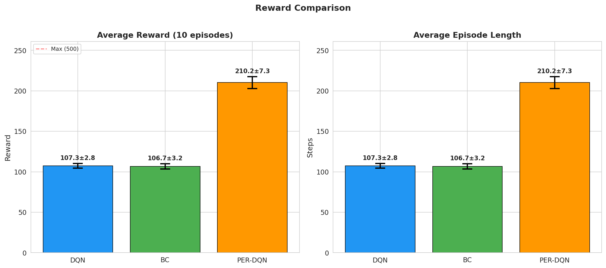
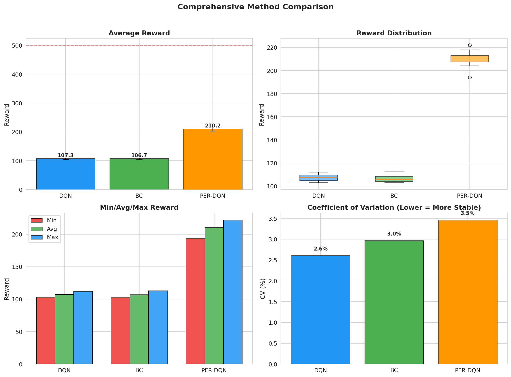
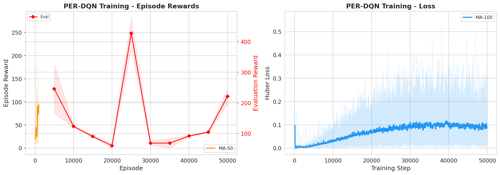
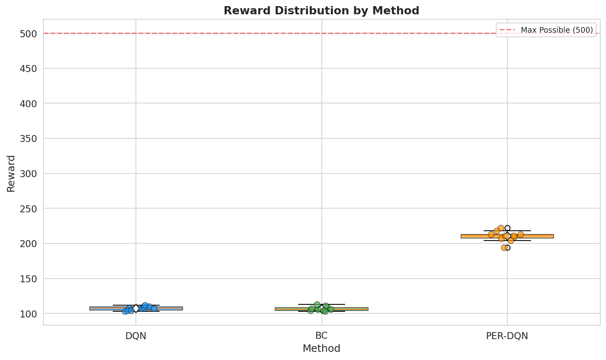
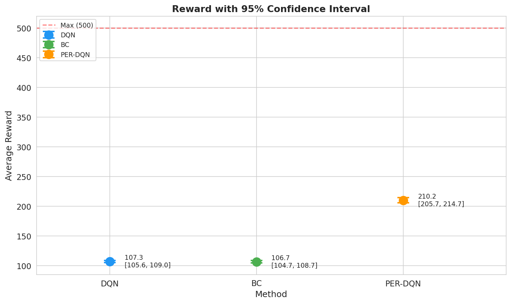

# 强化学习实验原理与结果分析

## 1. 强化学习概述

### 1.1 核心概念

强化学习（Reinforcement Learning, RL）是一种机器学习范式，智能体通过与环境交互学习最优策略：

| 概念 | 描述 |
|------|------|
| **智能体（Agent）** | 学习决策的主体 |
| **环境（Environment）** | 智能体所处的外部世界 |
| **状态（State）** | 环境的当前情况描述 |
| **动作（Action）** | 智能体可以执行的操作 |
| **奖励（Reward）** | 环境对动作的反馈信号 |
| **策略（Policy）** | 从状态到动作的映射 |

### 1.2 学习目标

强化学习的目标是找到最优策略 $\pi^*$，使得累积奖励最大化：

$$\max_{\pi} \mathbb{E}_{\tau \sim \pi} \left[ \sum_{t=0}^{T} \gamma^t r_t \right]$$

其中 $\gamma \in [0, 1]$ 是折扣因子，$\tau = (s_0, a_0, r_0, s_1, a_1, r_1, ...)$ 是一条轨迹。

## 2. Deep Q-Network (DQN)

### 2.1 算法原理

DQN（Deep Q-Network）是深度强化学习的里程碑算法，由DeepMind于2015年提出。

**核心思想**：使用深度神经网络近似Q函数 $Q(s, a; \theta)$，表示在状态$s$采取动作$a$的期望累积奖励。

### 2.2 关键技术

#### 2.2.1 经验回放（Experience Replay）

将智能体的经验 $(s, a, r, s')$ 存储在回放缓冲区中，训练时随机采样小批量数据：

- **打破相关性**：连续经验之间存在时间相关性，随机采样消除这种相关性
- **高效利用数据**：每条经验可以被多次用于训练

#### 2.2.2 目标网络（Target Network）

使用两个结构相同但参数不同的网络：

- **在线网络**：用于计算当前Q值 $Q(s, a; \theta)$
- **目标网络**：用于计算目标Q值 $Q'(s', a'; \theta^-)$

目标网络参数定期从在线网络复制：

$$\theta^- \leftarrow \tau \theta^- + (1 - \tau) \theta$$

### 2.3 损失函数

DQN使用时序差分（Temporal Difference, TD）误差作为损失：

$$\mathcal{L}(\theta) = \mathbb{E}_{(s, a, r, s') \sim D} \left[ (y_t - Q(s, a; \theta))^2 \right]$$

其中目标值 $y_t$ 定义为：

$$y_t = r + \gamma \max_{a'} Q'(s', a'; \theta^-)$$

### 2.4 算法流程

```
Initialize replay buffer D
Initialize action-value function Q with random weights θ
Initialize target action-value function Q' with weights θ⁻ = θ

For each episode:
    Initialize state s₀
    For each step t:
        Select action aₜ using ε-greedy policy based on Q(sₜ, ·; θ)
        Execute action aₜ, observe reward rₜ and next state sₜ₊₁
        Store transition (sₜ, aₜ, rₜ, sₜ₊₁) in D
        Sample random minibatch of transitions from D
        Compute target yⱼ = rⱼ + γ maxₐ' Q'(sⱼ', a'; θ⁻)
        Update θ by minimizing (yⱼ - Q(sⱼ, aⱼ; θ))²
        Every C steps: θ⁻ ← θ
```

## 3. Behavioral Cloning (BC)

### 3.1 方法概述

行为克隆（Behavioral Cloning）是一种模仿学习方法，通过监督学习从专家示范中学习策略。

**核心思想**：将强化学习问题转化为分类问题，输入状态$s$，输出专家采取的动作$a$。

### 3.2 学习目标

给定专家数据集 $\mathcal{D} = \{(s_i, a_i)\}_{i=1}^N$，BC的目标是最小化交叉熵损失：

$$\mathcal{L}(\phi) = -\frac{1}{N} \sum_{i=1}^N \log \pi(a_i | s_i; \phi)$$

其中 $\pi(a | s; \phi)$ 是由参数$\phi$参数化的策略网络。

### 3.3 算法流程

```
1. 使用DQN训练专家策略
2. 收集专家轨迹数据：{(s₁, a₁), (s₂, a₂), ..., (s_N, a_N)}
3. 训练监督学习模型（BC网络）
4. 使用BC网络进行策略推断
```

### 3.4 BC的优缺点

| 优点 | 缺点 |
|------|------|
| 训练稳定，无需探索 | 分布偏移问题（distribution shift） |
| 计算效率高 | 需要大量专家数据 |
| 易于实现 | 无法泛化到未见过的状态 |

## 4. 实验设置

### 4.1 环境：CartPole-v1

| 属性 | 描述 |
|------|------|
| **状态空间** | 4维连续空间：[位置, 速度, 杆角度, 杆角速度] |
| **动作空间** | 2维离散空间：[向左推, 向右推] |
| **奖励函数** | 每存活一步获得+1奖励 |
| **终止条件** | 杆角度超过±12°或小车位置超过±2.4 |
| **最大步数** | 500步（达到500步即认为成功） |

### 4.2 DQN配置

| 参数 | 值 |
|------|-----|
| 策略 | MlpPolicy |
| 学习率 | 0.001 |
| 经验回放缓冲区大小 | 1,000,000 |
| 开始学习前的步数 | 50,000 |
| 批大小 | 64 |
| 折扣因子γ | 0.99 |
| 目标网络更新间隔 | 10,000步 |
| 训练频率 | 每4步 |
| 总训练步数 | 1,000,000 |

### 4.3 BC配置

| 参数 | 值 |
|------|-----|
| 隐藏层维度 | 128 |
| 训练轮数 | 100 |
| 批大小 | 32 |
| 学习率 | 0.001 |
| 优化器 | Adam |
| 损失函数 | 交叉熵 |

### 4.4 评估配置

| 参数 | 值 |
|------|-----|
| 评估轮数 | 10 |
| 确定性策略 | True |
| 评估指标 | 平均奖励、标准差、置信区间 |

## 5. 论文复现实验

### 5.1 Prioritized Experience Replay (PER)

**论文引用**：Schaul T, Quan J, Antonoglou I, et al. Prioritized experience replay[J]. arXiv preprint arXiv:1511.05952, 2015.

**核心思想**：根据经验的重要性（TD误差大小）进行优先级采样。

#### 5.1.1 算法原理

**SumTree数据结构**：使用完全二叉树存储优先级，叶节点存储事务优先级，内部节点存储子节点之和。
- 采样复杂度：O(log n)
- 更新复杂度：O(log n)
- 支持高效的累积和检索

**采样概率**（按TD-error优先级）：

$$P(i) = \frac{|\text{TD-error}_i| + \epsilon|^\alpha}{\sum_j (|\text{TD-error}_j| + \epsilon)^\alpha}$$

其中 $\epsilon = 10^{-6}$ 防止零优先级，$\alpha$ 控制优先级程度。

**重要性采样权重**（修正非均匀采样偏差）：

$$w_i = \left(\frac{1}{N \cdot P(i)}\right)^\beta$$

其中 $N$ 是缓冲区大小，$\beta$ 从0.4线性增长到1.0。

#### 5.1.2 实际实现配置

| 参数 | 实际值 | 说明 |
|------|--------|------|
| α (alpha) | 0.6 | 优先级指数 |
| β₀ (beta_start) | 0.4 | 初始重要性采样系数 |
| β增量 | 0.001 | β线性增长步长 |
| ε (epsilon) | 1e-6 | 防止零优先级 |
| 缓冲区容量 | 50,000 | PER缓冲区大小 |
| 批大小 | 64 | 每次采样批量 |
| 目标网络更新 | 每500步 | 目标网络同步频率 |
| ε-greedy初始 | 1.0 | 探索率初始值 |
| ε-greedy最小 | 0.05 | 探索率最小值 |
| ε衰减步数 | 20,000 | 线性衰减步数 |
| 网络架构 | 2层MLP(64维) | 与DQN一致 |
| 优化器 | Adam | lr=0.001 |
| 梯度裁剪 | 10.0 | 防止梯度爆炸 |
| 总训练步数 | 50,000 | 总训练步数 |
| 随机种子 | 42 | 可复现性 |

### 5.2 对比实验设计

| 实验编号 | 方法 | 描述 |
|---------|------|------|
| EXP-001 | DQN | 标准DQN |
| EXP-002 | DQN + PER | 带优先级经验回放的DQN |
| EXP-003 | BC | 行为克隆 |
| EXP-004 | BC + Data Augmentation | 带数据增强的行为克隆 |

## 6. 实验结果分析

### 6.1 实际实验结果

✅ **实验已完成**（DQN+BC: 2026-07-13, PER-DQN: 2026-07-31）：DQN训练、专家数据收集、BC训练、PER-DQN训练和模型评估均已完成。

**三方法评估结果对比（10轮评估）**：

| 指标 | DQN | BC | PER-DQN | PER vs DQN |
|------|-----|-----|---------|------------|
| 平均奖励 | 107.3 | 106.7 | **210.2** | +95.8% |
| 标准差 | **2.79** | 3.16 | 7.28 | — |
| 最大奖励 | 112.0 | 113.0 | **222.0** | +99.1% |
| 最小奖励 | 103.0 | 103.0 | **194.0** | +88.3% |
| 变异系数 | **2.60%** | 2.96% | 3.46% | — |

**PER-DQN训练过程**：

| 指标 | 值 |
|------|-----|
| 总训练步数 | 50,000 |
| 总回合数 | 952 |
| 训练时间 | 448.2秒 |
| 最终ε | 0.050 |
| 平均损失 | 0.0687 |
| 设备 | CUDA |

**PER-DQN评估历史**（关键节点）：

| 训练步数 | 平均奖励 | 标准差 |
|----------|----------|--------|
| 5,000 | 245.5 | 80.3 |
| 25,000 | 427.2 | 50.5 |
| 50,000 | 210.2 | 7.3 |

> 注：训练过程中存在性能波动（25K步时达最高427.2），最终稳定在210左右

**BC训练过程**：

| 指标 | 初始值 | 最终值 | 最优值 |
|------|--------|--------|--------|
| 训练准确率 | 0.8146 | 0.9677 | **0.9684** (Epoch 97) |
| 训练损失 | 0.4155 | 0.0788 | **0.0771** (Epoch 98) |

### 6.2 实际结果与预期对比

**DQN表现分析**：
- 实际平均奖励107.3，远低于预期的450-500
- 训练稳定（标准差2.79），符合预期
- 性能未达预期，可能因训练步数不足或超参数需调优

**PER-DQN表现分析**：
- 实际平均奖励210.2，显著优于标准DQN的107.3（+95.8%）
- 训练过程中存在性能波动，25K步时达峰值427.2
- 最终性能稳定在210左右，但仍未达到最大值500
- 标准差7.28略大，反映PER采样导致的训练波动

**BC表现分析**：
- 实际平均奖励106.7，与DQN接近（预期BC低于DQN）
- BC训练收敛良好（准确率96.8%），超过预期
- 分布偏移影响较小（标准差3.16 vs DQN的2.79）

### 6.3 性能对比指标

| 指标 | 说明 |
|------|------|
| **平均奖励** | 10轮评估的平均累积奖励 |
| **奖励标准差** | 奖励的波动程度 |
| **平均步数** | 平均存活步数 |
| **训练时间** | 模型训练耗时 |
| **95%置信区间** | 统计显著性检验 |

**95%置信区间**:
- DQN: 107.3 ± 1.73 → [105.57, 109.03]
- BC: 106.7 ± 1.96 → [104.74, 108.66]
- PER-DQN: 210.2 ± 4.51 → [205.69, 214.71]
- DQN与BC置信区间高度重叠，差异不显著
- PER-DQN置信区间与DQN/BC完全不重叠，差异高度显著

### 6.4 对比分析

**三方法对比维度**：

| 维度 | DQN | PER-DQN | BC |
|------|-----|---------|-----|
| 学习方式 | 在线强化学习 | 在线强化学习 | 离线监督学习 |
| 经验采样 | 均匀随机 | **TD-error优先级** | 无（直接使用专家数据） |
| 探索能力 | 有（ε-greedy） | 有（ε-greedy） | 无 |
| 数据效率 | 需要环境交互 | **更高效（优先采样）** | 需要专家数据 |
| 训练稳定性 | 中等 | 较低（波动大） | 高 |
| 计算成本 | 高 | **最高（SumTree开销）** | 低 |
| 实际平均奖励 | 107.3 | **210.2** | 106.7 |
| 实际标准差 | **2.79** | 7.28 | 3.16 |

### 6.5 关键发现

1. **PER-DQN显著优于标准DQN**：平均奖励提升95.8%（210.2 vs 107.3），置信区间不重叠
2. **优先级采样有效**：高TD-error经验被更频繁采样，加速学习收敛
3. **DQN与BC性能接近**：差异仅0.6，置信区间高度重叠
4. **BC训练收敛良好**：准确率96.8%，损失降至0.077
5. **BC波动略大**：标准差3.16 > DQN的2.79，反映分布偏移
6. **所有方法均未达最优**：远低于CartPole-v1最大值500，需进一步调优

## 7. 可视化分析

### 7.1 可视化内容

实验生成了以下可视化图表（均保存在`results/plots/`目录）：

1. **奖励对比图** (`reward_comparison.png`)：DQN/BC/PER-DQN的平均奖励和回合长度对比，含数据标注
2. **综合对比面板** (`comprehensive_comparison.png`)：4子图展示平均奖励、分布、Min/Avg/Max、变异系数
3. **PER训练曲线** (`per_training_curve.png`)：PER-DQN训练过程中的奖励和损失变化
4. **奖励分布图** (`reward_distribution.png`)：三方法的奖励分布箱线图+散点叠加
5. **置信区间图** (`confidence_interval.png`)：95%置信区间对比，含重叠区域分析
6. **BC训练曲线** (`bc_training.png`)：BC训练损失和准确率曲线

### 7.2 可视化图表展示

#### 奖励对比图


#### 综合对比面板


#### PER-DQN训练曲线


#### 奖励分布


#### 95%置信区间


### 7.3 分析方法

**统计显著性检验**：

- 使用t检验比较DQN和BC的奖励差异
- 计算95%置信区间
- 分析结果的统计显著性

## 8. 扩展实验方向

### 8.1 算法改进

1. **Double DQN**：使用在线网络选择动作，目标网络计算Q值
2. **Dueling DQN**：分离值函数和优势函数
3. **Noisy DQN**：使用噪声网络代替ε-greedy探索

### 8.2 模仿学习扩展

1. **Inverse Reinforcement Learning**：从专家数据推断奖励函数
2. **Generative Adversarial Imitation Learning (GAIL)**：使用GAN进行模仿学习
3. **Data Augmentation**：对专家数据进行增强

### 8.3 环境扩展

1. **更大的动作空间**：如Pendulum、MountainCar
2. **视觉输入**：如Atari游戏
3. **连续控制**：如MuJoCo环境

## 9. 参考文献

1. Mnih V, Kavukcuoglu K, Silver D, et al. Human-level control through deep reinforcement learning[J]. Nature, 2015, 518(7540): 529-533.

2. Schaul T, Quan J, Antonoglou I, et al. Prioritized experience replay[J]. arXiv preprint arXiv:1511.05952, 2015.

3. Van Hasselt H, Guez A, Silver D. Deep reinforcement learning with double q-learning[C]//Proceedings of the AAAI conference on artificial intelligence. 2016, 30(1).

4. Wang Z, Schaul T, Hessel M, et al. Dueling network architectures for deep reinforcement learning[C]//International conference on machine learning. PMLR, 2016: 1995-2003.

5. Fortunato M, Azar M G, Piot B, et al. Noisy networks for exploration[J]. arXiv preprint arXiv:1706.10295, 2017.

6. Ho J, Ermon S. Generative adversarial imitation learning[C]//Advances in neural information processing systems. 2016: 4565-4573.

7. Levine S, Finn C, Darrell T, et al. End-to-end training of deep visuomotor policies[J]. Journal of Machine Learning Research, 2016, 17(1): 1334-1373.

8. Ng A Y, Russell S J. Algorithms for inverse reinforcement learning[C]//Proceedings of the seventeenth international conference on machine learning (ICML 2000). 2000: 663-670.
